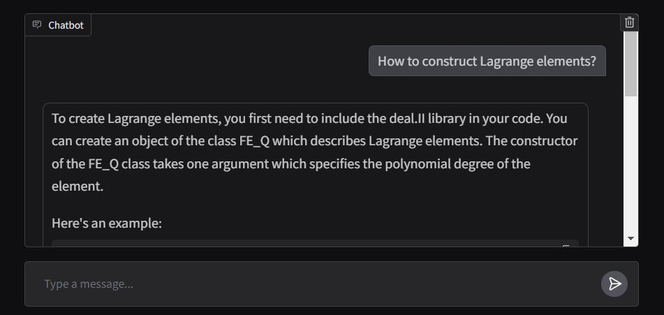

# deal.II Virtual Assistant

## Introduction

One of the most powerful applications of LLMs is the creation of sophisticated question-answering (Q&A) chatbots, capable of providing accurate answers based on specific source information. This project focuses on developing a virtual assistant for the [deal.II](https://www.dealii.org/) library, an open-source C++ finite element library, using a technique known as Retrieval-Augmented Generation (RAG). The dataset is sourced from 90 tutorial steps available in the official deal.II documentation, which can be accessed [here](https://dealii.org/current/doxygen/deal.II/Tutorial.html). The large language model (LLM) engine is provided by [Cohere](https://cohere.com/) which is known for delivering high-quality LLM models for embeddings and chat services. For the vector database, we chose [Chroma](https://www.trychroma.com/) due to its open-source nature, speed, and efficiency in searching and retrieving vectors. The [Langchain](https://www.langchain.com/) framework is used to efficiently manage the interaction between the user's input, the processing of queries, and the retrieval of relevant information from the vector database, ensuring seamless integration between various components of the model.

## Data Preparation

The process for preparing the database is as follows: First, the tutorial pages are retrieved from the website as Langchain Document objects. To improve access speed (during testing time), these Document objects are saved as JSON files on the local disk. Next, the documents are split into appropriately sized chunks (around 400 tokens per chunk with an overlap of 40 tokens). In total, the dataset comprises 2.3 million tokens. Finally, these split documents are embedded into the vector database.

## Model Architecture

The model is built using four chains and three prompt templates.

1. **Reformulate Chain**: This chain receives the user's question and conversation history, then reformulates the question based on the previous dialogue. For instance, if the first question is "What is FE_Nothing?" and the second question is "Where can I use it?", the reformulation chain will modify the second question to "Where can I use FE_Nothing?" This step essentially adds memory to the conversation, ensuring context continuity.

2. **Multi-Question Chain**: This chain takes the reformulated question and generates five similar questions, providing multiple perspectives. It outputs a Python list of questions using a simple lambda function, and any empty lines are removed using the `remove_empty_string` function as the final step.

3. **Retrieval Chain**: This chain takes the five questions from the previous chain and queries the vector database. The vector database searches for similar vectors and retrieves relevant documents. Since the same document might be retrieved multiple times for different questions, a unique set of documents is created using the `get_unique_union` function as the last step.

4. **RAG Chain**: This chain uses the question, conversation history, and the retrieved documents from the previous chain as the context to generate the final answer.

## Deployment

The front end of the application is built using Gradio's `ChatInterface`, with the response function designed to stream the output in real time.
The application is deployed in the Hugging Face Spaces and can be accessed [here](https://huggingface.co/spaces/mma666/dealii_assistant).
